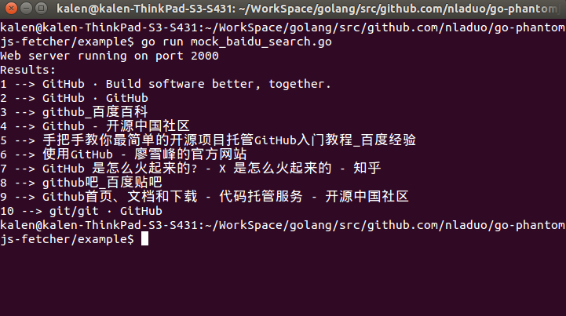
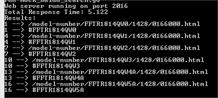
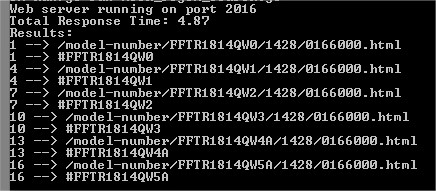

# go-phantomjs-fetcher
[pyspider phantomjs fetcher](https://github.com/binux/pyspider/tree/master/pyspider/fetcher) clone in golang.

## Installation
### Install PhantomJS
You can download the phantomjs executable binary [here](http://phantomjs.org/download.html). And add it to your $PATH.
### Clone the Source
``` shell
go get github.com/PuerkitoBio/goquery           # used in example
go get github.com/refusetofeel/go-phantomjs-fetcher
```

## Example - Normal usage
```shell
cd $GOPATH/src/github.com/refusetofeel/go-phantomjs-fetcher
go run ./example/normal/mock_baidu_search.go
```


## Example 2 - Regex used to cancel unneeded requests
Using a heavy angularjs website to test  
Speeds will be faster when using phantomjs on a dedicated server system, my samples tests on my LINUX server where 2+ seconds less then shown.  
These are tests done on Windows 8  

```shell
cd $GOPATH/src/github.com/refusetofeel/go-phantomjs-fetcher
go run ./example/regex/mock_regex_search.go
```
Without Regex:  


With Regex:  


## LICENSE
MIT
